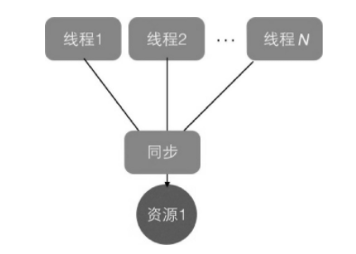
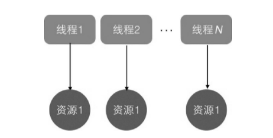
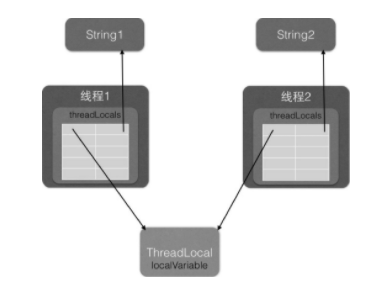

# ThreadLocal源码分析

多线程访问同一个共享变量时，特别容易出现并发问题，特别是在多个线程需要对一个共享变量进行写入时。为了保证线程安全，一般使用者在访问共享变量时，需要进行适当的同步。



同步的措施一般是加锁，这就需要使用者对锁有一定的了解，这显然加重了使用者的负担。那么有没有一种方式可以做到，当创建一个变量后，每个线程对其进行访问的时候，访问的是自己线程的变量呢？其实ThreadLocal就可以做这件事情，虽然ThreadLocal并不是为了解决这个问题而出现的。

ThreadLocal是JDK包提供的，它提供了线程本地变量，也就是如果你创建了一个ThreadLocal变量，那么访问这个变量的每个线程都会有这个变量的一个本地副本。当多个线程操作这个变量时，实际操作的是自己本地内存里面的变量，从而避免了线程安全问题。创建一个ThreadLocal变量后，每个线程都会复制一个变量到自己的本地内存。



## 1. ThreadLocal使用示例

开启两个线程，在每个线程内部都设置了本地变量的值，然后调用print函数打印当前本地变量的值。如果打印后调用了本地变量的remove方法，则会删除本地内存中的该变量。

```java
public class ThreadLocalTest {
    // (1) print方法
    static void print(String str) {
        // 1.1 打印当前线程本地内存中localVariable变量的值
        System.out.println(str + ":" + localVariable.get());
        // 1.2 清除当前线程本地内存中的localVariable变量
        //localVariable.remove();
    }

    // (2) 创建ThreadLocal
    static ThreadLocal<String> localVariable = new ThreadLocal<>();

    public static void main(String[] args) {
        // (3) 创建threadOne
        Thread threadOne = new Thread(new Runnable() {
            @Override
            public void run() {
                // 3.1 设置threadOne中本地变量localVariable的值
                localVariable.set("threadOne local variable");
                // 3.2 调用打印函数
                print("threadOne");
                // 3.3 打印本地变量值
                System.out.println("threadOne remove after" + ":" + localVariable.get());
            }
        });
        // (4) 创建threadTwo
        Thread threadTwo = new Thread(new Runnable() {
            @Override
            public void run() {
                // 4.1 设置threadTwo中本地变量localVariable的值
                localVariable.set("threadTwo local variable");
                // 4.2 调用打印函数
                print("threadTwo");
                // 4.3 打印本地变量值
                System.out.println("threadTwo remove after" + ":" + localVariable.get());
            }
        });
        // (5) 启动线程
        threadOne.start();
        threadTwo.start();
    }
}
```

运行结果如下：

```
threadOne:threadOne local variable
threadOne remove after:threadOne local variable
threadTwo:threadTwo local variable
threadTwo remove after:threadTwo local variable
```

代码(2)创建了一个ThreadLocal变量。

代码(3)和(4)分别创建了threadOne和threadTwo。

代码(5)启动了两个线程。

threadOne中的代码3.1通过set方法设置了localVariable的值，这其实设置的是线程One本地内存中的一个副本，这个副本线程Two是访问不了的。然后代码3.2调用print方法，代码1.1通过get方法获取了当前线程（线程One）本地内存中localVariable的值。

线程Two的执行类似于线程One。

打开代码1.2的注释后，再次运行，运行结果如下：

```
threadOne:threadOne local variable
threadOne remove after:null
threadTwo:threadTwo local variable
threadTwo remove after:null
```


## 2. ThreadLocal的实现原理

Thread类中有一个threadLocals和一个inheritableThreadLocals，它们都是ThreadLocalMap类型的变量，而ThreadLocalMap是一个定制化的HashMap。在默认情况下，每个线程中的这两个变量都为null，只有当前线程第一次调用ThreadLocal的set或者get方法时才会创建它们。其实每个线程的本地变量不是存放在ThreadLocal实例里面，而是存放在调用线程的threadLocals变量里面。也就是说，ThreadLocal类型的本地变量存放在具体的线程内存空间中。ThreadLocal就是一个工具壳，它通过set方法把value值放入调用线程的threadLocals里面并存放起来。当调用线程调用它的get方法时，再从当前线程的threadLocals变量里面将其拿出来使用。如果调用线程一直不终止，那么这个本地变量会一直存放在调用线程的threadLocals变量里面，所以当不需要使用本地变量时可以通过调用ThreadLocal变量的remove方法，从当前线程的threadLocals里面删除本地变量。另外，Thread里面的threadLocals为何被设计为map结构？很明显是因为每个线程可以关联多个ThreadLocal变量。

下面简单分析ThreadLocal的set、get及remove方法的实现逻辑

### 2.1 public void set(T value)

```java
 public void set(T value) {
     // (1)获取当前线程
     Thread t = Thread.currentThread();
     // (2)将当前线程作为key，去查找对应的线程变量，找到则设置
     ThreadLocalMap map = getMap(t);
     if (map != null)
         map.set(this, value);
     else
     // (3)第一次调用就创建当前线程对应的HashMap
         createMap(t, value);
 }
```

代码(1)首先获取调用线程，然后使用当前线程作为参数调用`ThreadLocalMap getMap(Thread t)`方法。

```java
ThreadLocalMap getMap(Thread t) {
    return t.threadLocals;
}
```

可以看到，`ThreadLocalMap getMap(Thread t)`的作用是获取线程自己的变量threadLocals，threadLocal变量被绑定到了线程的成员变量上。

如果`ThreadLocalMap getMap(Thread t)`的返回值不为空，则把value值设置到threadLocals中，也就是把当前变量放入当前线程的内存变量threadLocals中。threadLocals是一个HashMap结构，其中key就是当前ThreadLocal的实例对象引用，value是通过set方法传递的值。

如果`ThreadLocalMap getMap(Thread t)`返回空值，则说明是第一次调用set方法，这时使用`void createMap(Thread t, T firstValue)`创建当前线程的threadLocals变量。

```java
void createMap(Thread t, T firstValue) {
    t.threadLocals = new ThreadLocalMap(this, firstValue);
}
```

### 2.2 public T get()

```java
public T get() {
    // (4)获取当前线程
    Thread t = Thread.currentThread();
    // (5)获取当前线程的threadLocals变量
    ThreadLocalMap map = getMap(t);
    // (6)如果threadLocals不为null，则返回对应本地变量的值
    if (map != null) {
        ThreadLocalMap.Entry e = map.getEntry(this);
        if (e != null) {
            @SuppressWarnings("unchecked")
            T result = (T)e.value;
            return result;
        }
    }
    // (7)threadLocals为空，则初始化当前线程的threadLocals的成员变量
    return setInitialValue();
}
```

代码(4)首先获取当前线程实例，如果当前线程的threadLocals变量不为null，则直接返回当前线程绑定的本地变量，否则执行代码(7)进行初始化。`private T setInitialValue()`的代码如下：

```java
private T setInitialValue() {
    // (8)初始化为null
    T value = initialValue();
    Thread t = Thread.currentThread();
    ThreadLocalMap map = getMap(t);
    // (9)如果当前线程的threadLocals变量不为空
    if (map != null)
        map.set(this, value);
    // (10)如果当前线程的threadLocals变量为空
    else
        createMap(t, value);
    return value;
}

protected T initialValue() {
    return null;
}
```

### 2.3 public void remove()

```java
public void remove() {
    ThreadLocalMap m = getMap(Thread.currentThread());
    if (m != null)
        m.remove(this);
}
```

如以上代码所示，如果当前线程的threadLocals变量不为空，则删除当前线程中指定ThreadLocal实例的本地变量。

### 2.4 总结



如图所示，在每个线程内部都有一个名为threadLocals的成员变量，该变量的类型为HashMap，其中key为我们定义的ThreadLocal变量的this引用，value则为我们使用set方法设置的值。每个线程的本地变量存放在线程自己的内存变量threadLocals中，如果当前线程一直不消亡，这些本地变量会一直存在，可能会造成内存逸出，因此使用完后记得调用ThreadLocal的remove方法删除对应线程的threadLocals中的本地变量。

