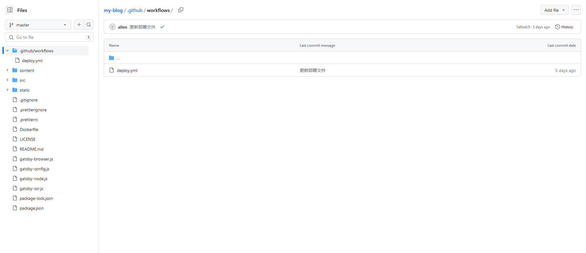

# GitHub Actions

GitHub Actions是GitHub提供的一个工作流，可以帮助我们完成项目构建、打包、部署等操作。
平时自己维护的小网站，需要先在本地构建静态文件，然后上传服务器部署，中间的步骤繁琐且重复。
为了提高效率，决定使用GitHub Actions来帮助自己完成上述操作。

## 创建workflows文件

既然是使用Actions，我们需要先在GitHub拥有自己的项目。在GitHub项目的根目录下创建文件夹 `.github/workflows`，
并在此文件夹中创建文件 `deploy.yml` 文件。（此处文件的文件名可以根据自己的需求修改）



文件创建好后，我们就可以在此文件进行后续的配置。接下来将会依次说明用到的配置。

## 工作流名称
通过 `name` 属性，可以定义工作流的名称。
```yaml
name: 部署到云服务器
```

## 工作流触发条件
通过 `on` 属性，可以定义工作流的触发条件，
```yaml
name: 部署到云服务器
on:
  push:
    branches:
      - master
```
上面代码定义的触发条件：当master分支被push时

## 工作流任务
通过 `jobs` 属性，可以定义工作流的任务。以下为完整的工作流任务。
```yaml
name: 部署到云服务器

on:
  push:
    branches:
      - master

jobs:
  build:
    runs-on: ubuntu-latest
    steps:
      - name: Checkout Repository
        uses: actions/checkout@v2

      - name: Set up Node.js
        uses: actions/setup-node@v3
        with:
          node-version: '18'

      - name: Install Dependencies
        run: npm install

      - name: Build Project
        run: npm run build

      - name: Set up Docker Buildx
        uses: docker/setup-buildx-action@v1

      - name: Build and Push Docker Image
        env:
          DOCKER_USERNAME: ${{secrets.DOCKER_USERNAME}}
          DOCKER_PASSWORD: ${{secrets.DOCKER_PASSWORD}}
        run: |
          echo $DOCKER_PASSWORD | docker login -u $DOCKER_USERNAME --password-stdin
          docker buildx create --use
          docker buildx inspect
          docker buildx build --platform linux/amd64,linux/arm64 -t zhangquanli/my-blog:latest --push .

      - name: Deploy to Server
        env:
          SSH_HOST: ${{secrets.SSH_HOST}}
          SSH_USERNAME: ${{secrets.SSH_USERNAME}}
          SSH_PRIVATE_KEY: ${{secrets.SSH_PRIVATE_KEY}}
        run: |
          echo "$SSH_PRIVATE_KEY" > ssh_key
          chmod 600 ssh_key
          ssh -i ssh_key -o StrictHostKeyChecking=no $SSH_USERNAME@$SSH_HOST "docker stop my-blog; docker rm my-blog; docker rmi zhangquanli/my-blog; docker pull zhangquanli/my-blog; docker run --name my-blog -p 80:80 -d zhangquanli/my-blog"
```

### 定义使用的运行环境
此处使用的运行环境为Ubuntu，此环境是GitHub提供的，具体可以使用哪些，可以查看官方文档。
```yaml
jobs:
  build:
    runs-on: ubuntu-latest
```

### 定义任务的各个步骤
`steps` 可以一步一步得编写整个流程
```yaml
jobs:
  build:
    runs-on: ubuntu-latest
    steps:
      - name: Checkout Repository
        uses: actions/checkout@v2
```

### 拉取代码
```yaml
jobs:
  build:
    runs-on: ubuntu-latest
    steps:
      - name: Checkout Repository
        uses: actions/checkout@v2
```

### 安装 nodejs
```yaml
jobs:
  build:
    runs-on: ubuntu-latest
    steps:
      - name: Checkout Repository
        uses: actions/checkout@v2

      - name: Set up Node.js
        uses: actions/setup-node@v3
        with:
          node-version: '18'
```

### npm install
```yaml
jobs:
  build:
    runs-on: ubuntu-latest
    steps:
      - name: Checkout Repository
        uses: actions/checkout@v2

      - name: Set up Node.js
        uses: actions/setup-node@v3
        with:
          node-version: '18'

      - name: Install Dependencies
        run: npm install
```

### npm run build
```yaml
jobs:
  build:
    runs-on: ubuntu-latest
    steps:
      - name: Checkout Repository
        uses: actions/checkout@v2

      - name: Set up Node.js
        uses: actions/setup-node@v3
        with:
          node-version: '18'

      - name: Install Dependencies
        run: npm install

      - name: Build Project
        run: npm run build
```

### 安装 Docker Buildx
```yaml
jobs:
  build:
    runs-on: ubuntu-latest
    steps:
      - name: Checkout Repository
        uses: actions/checkout@v2

      - name: Set up Node.js
        uses: actions/setup-node@v3
        with:
          node-version: '18'

      - name: Install Dependencies
        run: npm install

      - name: Build Project
        run: npm run build

      - name: Set up Docker Buildx
        uses: docker/setup-buildx-action@v1
```

### 构建 docker 镜像并 push 镜像
这里需要注意，要将构建好的镜像上传到dockerhub，需要使用dockerhub的账号密码。
```yaml
jobs:
  build:
    runs-on: ubuntu-latest
    steps:
      - name: Checkout Repository
        uses: actions/checkout@v2

      - name: Set up Node.js
        uses: actions/setup-node@v3
        with:
          node-version: '18'

      - name: Install Dependencies
        run: npm install

      - name: Build Project
        run: npm run build

      - name: Set up Docker Buildx
        uses: docker/setup-buildx-action@v1

      - name: Build and Push Docker Image
        env:
          DOCKER_USERNAME: ${{secrets.DOCKER_USERNAME}}
          DOCKER_PASSWORD: ${{secrets.DOCKER_PASSWORD}}
        run: |
          echo $DOCKER_PASSWORD | docker login -u $DOCKER_USERNAME --password-stdin
          docker buildx create --use
          docker buildx inspect
          docker buildx build --platform linux/amd64,linux/arm64 -t zhangquanli/my-blog:latest --push .
```